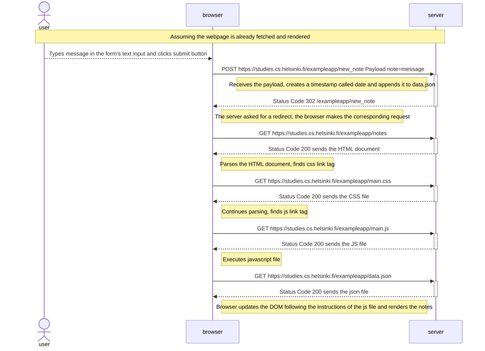

```mermaid
sequenceDiagram
  actor user
  participant browser
  participant server

  Note over user,server: Assuming the webpage is already fetched and rendered
  user-->>browser: Types message in the form's text input and clicks submit button
  browser->>+server: POST https://studies.cs.helsinki.fi/exampleapp/new_note Payload note=message
  Note left of server: Receives the payload, creates a timestamp called date and appends it to data.json 
  server-->>-browser: Status Code 302 /exampleapp/new_note
  Note right of browser: The server asked for a redirect, the browser makes the corresponding request
  browser->>+server: GET https://studies.cs.helsinki.fi/exampleapp/notes
  server-->>-browser: Status Code 200 sends the HTML document
  Note right of browser: Parses the HTML document, finds css link tag
  browser->>+server: GET https://studies.cs.helsinki.fi/exampleapp/main.css
  server-->>-browser: Status Code 200 sends the CSS file
  Note right of browser: Continues parsing, finds js link tag
  browser->>+server: GET https://studies.cs.helsinki.fi/exampleapp/main.js
  server-->>-browser: Status Code 200 sends the JS file
  Note right of browser: Executes javascript file
  browser->>+server: GET https://studies.cs.helsinki.fi/exampleapp/data.json
  server-->>-browser: Status Code 200 sends the json file
  Note right of browser: Browser updates the DOM following the instructions of the js file and renders the notes
```