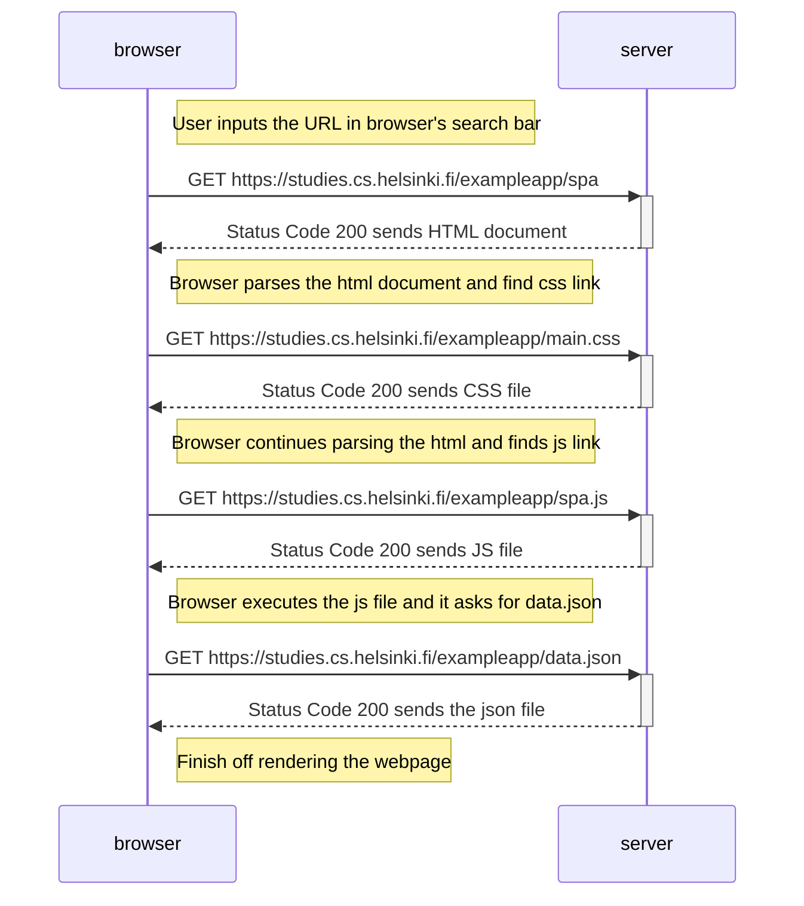

```mermaid
sequenceDiagram
  participant browser
  participant server
  Note right of browser: User inputs the URL in browser's search bar
  browser->>+server: GET https://studies.cs.helsinki.fi/exampleapp/spa
  server-->>-browser: Status Code 200 sends HTML document
  Note right of browser: Browser parses the html document and find css link
  browser->>+server: GET https://studies.cs.helsinki.fi/exampleapp/main.css
  server-->>-browser: Status Code 200 sends CSS file
  Note right of browser: Browser continues parsing the html and finds js link
  browser->>+server: GET https://studies.cs.helsinki.fi/exampleapp/spa.js
  server-->>-browser: Status Code 200 sends JS file
  Note right of browser: Browser executes the js file and it asks for data.json
  browser->>+server: GET https://studies.cs.helsinki.fi/exampleapp/data.json
  server-->>-browser: Status Code 200 sends the json file
  Note right of browser: Finish off rendering the webpage
```