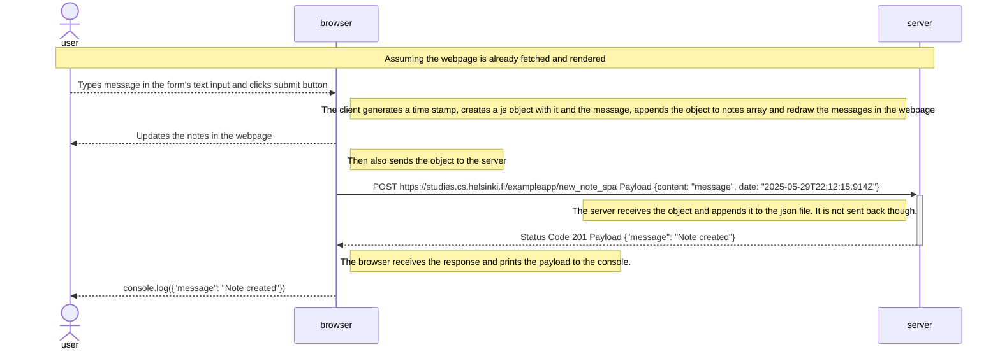

```mermaid
sequenceDiagram
  actor user
  participant browser
  participant server

  Note over user,server: Assuming the webpage is already fetched and rendered
  user-->>browser: Types message in the form's text input and clicks submit button
  Note right of browser: The client generates a time stamp, creates a js object with it and the message, appends the object to notes array and redraw the messages in the webpage
  browser-->>user: Updates the notes in the webpage
  Note right of browser: Then also sends the object to the server
  browser->>+server: POST https://studies.cs.helsinki.fi/exampleapp/new_note_spa Payload {content: "message", date: "2025-05-29T22:12:15.914Z"}
  Note left of server: The server receives the object and appends it to the json file. It is not sent back though.
  server-->>-browser: Status Code 201 Payload {"message": "Note created"}
  Note right of browser: The browser receives the response and prints the payload to the console.
  browser-->>user: console.log({"message": "Note created"});

```